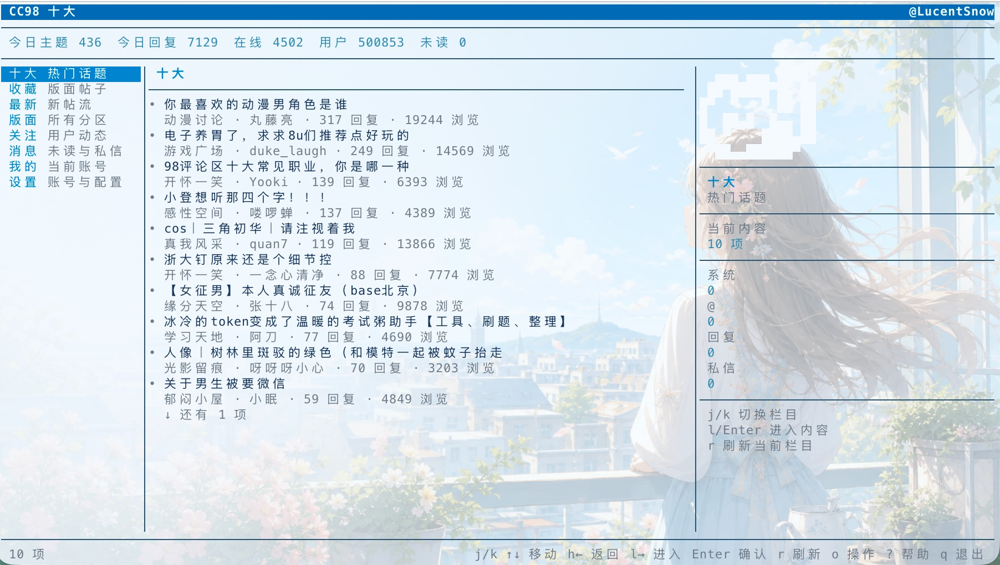

# CC98-CLI

CC98 的命令行客户端，包含面向脚本使用的 CLI 和适合日常浏览的 TUI。

- 直接运行 `cc98`：进入终端界面。
- 带参数运行 `cc98 <command>`：执行 CLI，默认输出 JSON。
- 当前主要面向读取场景，TUI 会尽量按需加载和缓存，减少请求。

## 概要

vibe coding 累了的话，不妨在终端里水水 98。

这是一个个人兴趣项目，基于 CC98 的公开接口实现，与 CC98 官方无关。请合理使用本工具，避免违反 CC98 的用户协议。

## 预览

<p align="center">
  
</p>

## 安装

需要 Node.js 20+。

```bash
npm install -g cc98-cli
```

## 登录

```bash
cc98 login
```

多账号：

```bash
cc98 account list
cc98 account use <name>
cc98 --account <name> me
```

## TUI

```bash
cc98
```

常用按键：

```text
j/k 或 ↑/↓        上下移动
l 或 →            进入下一层
h 或 ←            返回上一层
Enter             确认执行
r                 刷新
o                 打开操作菜单
?                 显示帮助
n 或 Space        加载更多
q                 退出
```

左栏导航包含：十大、收藏、最新、版面、关注、消息、通知、我的、更多、设置。

当前 TUI 已拆分为入口、控制器、渲染器、组件、状态和帖子阅读器几个模块。`src/tui/app.ts` 只负责终端生命周期和依赖组装，具体按键处理与异步加载在 `controller.ts`，布局渲染在 `renderer.ts` 和 `components/`。

## CLI

CLI 默认输出 JSON，适合配合 `jq` 或脚本使用。

```bash
cc98 me
cc98 topic <topic-id>
cc98 board <board-id>
cc98 search <keyword>
cc98 message recent
cc98 update
```

查看完整命令：

```bash
cc98 --help
cc98 topic --help
cc98 user --help
cc98 update --help
```

## 本地数据

登录信息和缓存保存在：

```text
~/.cc98-cli/
```

## 开发

```bash
npm install
npm run check
npm run build
node dist/main.js
```

## 致谢

- [Ansherly](https://github.com/Ansherly)：感谢前辈的积极鼓励！
- [CC98-Desktop](https://github.com/Ansherly/CC98-Desktop)：部分 TUI 信息架构参考了该桌面客户端的交互设计。

## License

MIT
